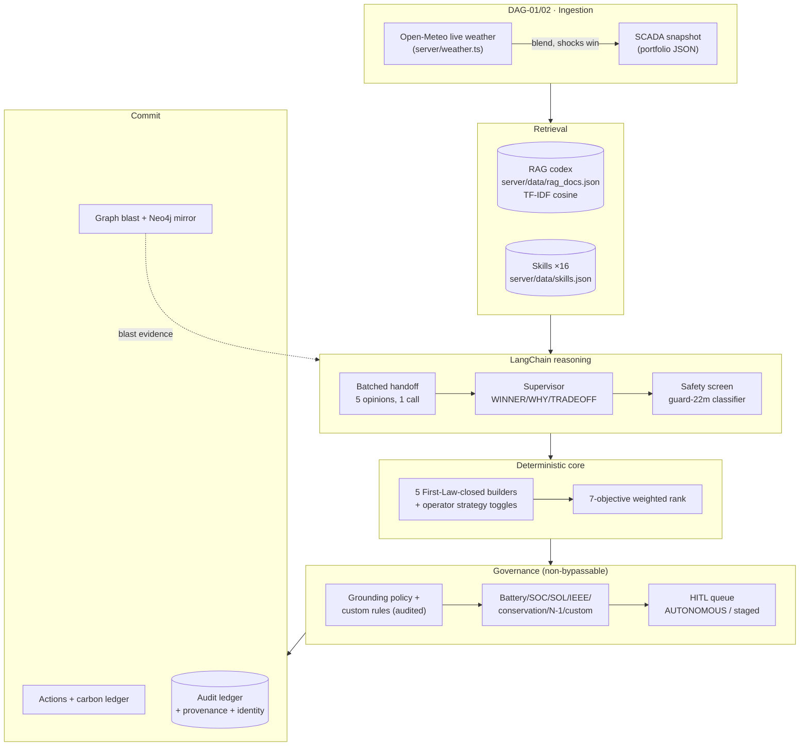
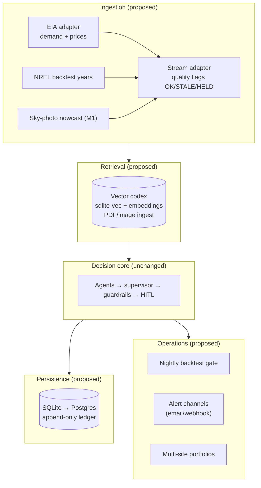

# Architecture — Current & Proposed

> Companion to `SUBMISSION.md` (claims) and `README.md` (run instructions).
> Diagrams are Mermaid — rendered natively on GitHub.

## Current architecture (as built)

**Request flow** (`server.ts`): `POST /api/agentic-orchestrate` → zod → weather blend →
`executeDag(DAG-01/02)` → RAG search → handoff → candidates → supervisor →
strict-AI gate → safety screen → guardrails (+custom) → HITL assess → carbon →
actions → `executeDag(03–12)` → response with `dagRunId`. Progress streams via
`GET /api/dag/progress` (800 ms poll). File writes are atomic (`server/store.ts`).

**Key invariant**: the LLM may only *select* precomputed candidates and justify;
all MW/$ numbers come from deterministic code. Every fallback is labeled
(`modelUsed`), every mutation is RBAC-gated and identity-stamped in audit.

## Proposed architecture (roadmap, not built)

**What changes vs today** (and what deliberately doesn't):
1. **Inputs**: EIA demand/prices replace drift simulation; NREL years feed the
   gauntlet; stream adapter adds quality flags; sky-photo nowcast blends like
   Open-Meteo. The shock-override rule survives: operator input always wins.
2. **Retrieval**: TF-IDF → embeddings; `searchRag(query, topK)` signature unchanged
   so agents are unaffected.
3. **Storage**: JSON → SQLite (then Postgres); audit stays append-only; RBAC matrix unchanged.
4. **New services, same gates**: backtest harness (deterministic replay, zero LLM
   spend), alert channels, multi-site — all consume the existing decision contract.
5. **Unchanged by design**: candidate builders, scoring math, guardrail veto
   semantics, HITL tiers, permission matrix, provenance taxonomy.

**Migration order** (cheapest credibility first): EIA adapter → backtest scorecard
→ SQLite → embeddings/PDF → vision nowcast → alert channels → multi-site.
Each step is independently demoable and leaves the decision core untouched.

---

## Detailed breakdown: process flow, actions, decisions, models, features

One dispatch cycle, phase by phase — what runs, what is decided, which model
reasons, and which claimed feature each phase demonstrates.

| # | Phase (code) | Key actions | Decision made | Model usage | Features incorporated → demo claim |
|---|---|---|---|---|---|
| 0 | Ingest `DAG-01/02` | Fetch Open-Meteo per site; blend wind/cloud/temp; preserve shock states | Live vs simulated source; shock-wins rule | None (deterministic) | Live telemetry (F3 input realism); weather switch |
| 1 | Retrieve | TF-IDF cosine over codex; skill prompt assembly | Top-5 docs + per-agent directives | None (deterministic) | Editable RAG/skills; ask-agent citations |
| 2 | Handoff | 1 batched LangChain call → 5× VOTE/REC/CONF; grid evidence incl. blast-radius | 5 independent votes + confidences | gemini-3.8-flash → Groq chain (validated) | Council reasoning; dissent; Grid blast tool |
| 3 | Simulate | 5 First-Law-closed builders; DR/charge/discharge maps | Per-strategy MW setpoints, imports, curtailment | None (physics) | F1 action clusters; strategy toggles |
| 4 | Rank | 7 objectives × live weights → composite; reliability veto | Ordered ranking + winner math-top | None (arithmetic) | F2 criteria; presets re-rank live |
| 5 | Supervise | LangChain WINNER/WHY/TRADEOFF over enabled only | Final strategy + justification | Same chain (validated) | Select-don't-compute; trade-off narrative |
| 6 | Safety screen | Prompt-guard classifies rationale (native format) | Benign → continue; malicious → veto | guard-2-22m classifier | Injection defense; fail-open noted |
| 7 | Guardrails | Ratings/SOC/SOL/IEEE/conservation/N-1/custom rules vs admin policy | PASS/WARN/FAIL per gate | None (rules) | Editable tolerances + custom rules; N-1 |
| 8 | HITL gate | Confidence + impact classifier → tier; stage or dispatch | AUTONOMOUS vs staged pendingId | None (rules) | Plan-then-execute; RBAC; approver identity |
| 9 | Commit | Actions, carbon ledger, hash, audit, mirror sync | Final record + provenance label | None | Audit badges; Neo4j lineage; carbon |

### Model inventory (every model, exact role, fallback)

| Model | Role | Input → output | If unavailable |
|---|---|---|---|
| `gemini-3.8-flash` | Handoff + supervisor (first try) | skills+evidence+RAG → votes; votes+math → winner | 429 → immediate failover (daily) / 1 retry (transient) |
| `openai/gpt-oss-120b` → `20b` → `safeguard-20b` → `qwen3.8-27b` | Ordered reasoning fallback | same contracts, format-validated | per-model 1h hard-skip; all fail → deterministic |
| `llama-prompt-guard-2-22m` | Safety screen only | rationale text → benign/malicious/score | fail-open with note; never votes |
| Deterministic heuristics | Handoff/supervisor fallback | same contracts, math-optimal | always available; labeled, never called AI |
| TF-IDF (not a model) | Retrieval | query → ranked docs | n/a (offline) |

### Claim → mechanism → demo evidence

| Submission claim | Architectural mechanism | Working-demo moment |
|---|---|---|
| Council reasoning, not black box | Handoff votes + confidences in trace; live DAG strip | Price spike: dissenting votes visible, then convergence |
| Numbers never hallucinated | Builders/scoring outside LLM; supervisor select-only; codex-only ask rule | Corrupt-store + fallback runs keep exact figures; retrievedDocs listed |
| Safety is structural | Guardrail FAIL veto; prompt-guard veto; locked DAG-08/08S; bounded policy edits | BESS trip lockout; custom FAIL rule blocks $340 dispatch (proven live) |
| Humans govern critical plans | Staged pendingId; RBAC approve; approver identity; alternate picker | 30 MW DR staged at 98% → approve → badge flips to named approver |
| Operators own the brain | Skills/RAG/DAG/policy/rules/weather/strategy edits, all audited | Live edit → next cycle reflects it; history shows who/when/old→new |
| Topology-aware | Blast math in agent evidence + N-1 gate + Aura mirror with staleness badge | LINE-NORTH trip preview; N-1 FAIL on blackout; seed/prune verified |
| Honest under failure | Labeled fallbacks; Strict-AI hold; atomic stores; circuit + pacing telemetry | Quota-dead demo still decides safely; `/api/llm/status` narrates |
